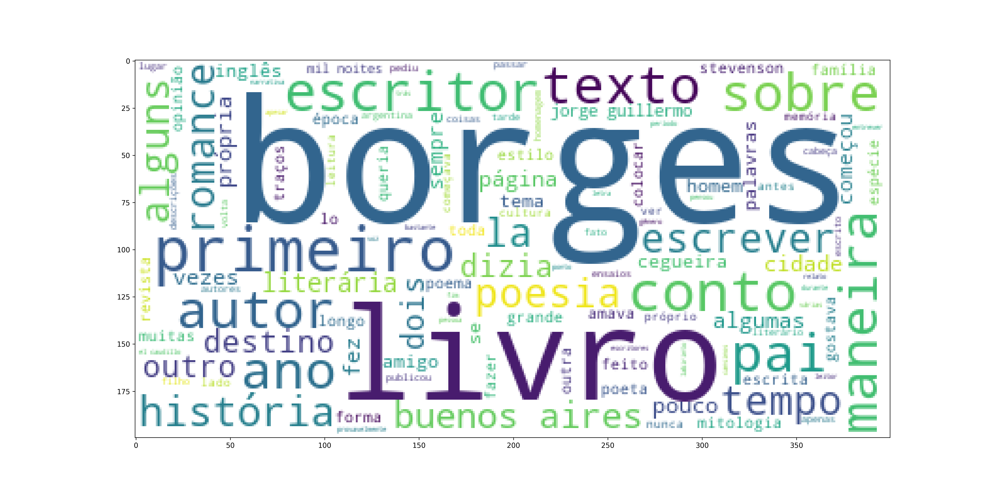

# 📝 Sumarização extrativa de texto  com BERT e K-Means
<p>Este repositório contém uma implementação da sumarização extrativa de texto, utilizando embeddings do BERT e agrupamentos do K-Means. </p>
<p>Essa implementação tem 4 estratégias diferentes de sumarização:</p>
<li><b>Parágrafos centrais</b>: Extrai todos os parágrafos que tem relação com o assunto principal do texto. Ideal para textos fortemente estruturados em parágrafos.</li>
<li><b>Sentenças centrais</b>: Extrai todas as sentenças que tem relação com o assunto principal do texto. Ideal para textos sem estrutura definida.</li>
<li><b>Parágrafos chave</b>: Extrai parágrafos chave apenas. Útil para saber do que o texto se trata. Ideal para textos fortemente estruturados em parágrafos.</li>
<li><b>Sentenças chave</b>: Extrai sentenças chave apenas. Útil para saber do que o texto se trata. Ideal para textos sem estrutura definida.</li>
<br/>
<p> As estratégias de extração do assunto central são baseada nos <i>N</i> clusters com o maior número de instâncias, enquanto as estratégias de assunto chave são baseadas nas <i>N</i> instâncias mais próximas de cada centróide. A distância é calculada com a similaridade de cossenos. </p>
<br/>
<p>A qualidade da sumarização pode variar de forma drástica dependendo da escolha de estratégia, parâmetros do algoritmo e qualidade do texto. Nem sempre o algoritmo é capaz de gerar bons resultados</p>


## 💾 Instalando como módulo
<br>

``` 
git clone https://github.com/joao-savietto/bert-summarizer.git
cd bert-summarizer
python setup.py install
```

# 🔎 Exemplo de uso


[O texto desse artigo será usado para exemplificar o uso do algoritmo](http://saopauloreview.com.br/como-se-faz-um-escritor-ensaio-sobre-a-formacao-de-jorge-luis-borges/)

<p> Instale a biblioteca <i>html-text</i> para extrair o texto do site </p> 

```
pip install html-text==0.5.2
```

Execute o código:

```
from bertsummarizer.summarizer import BertSummarizer
import html_text
import requests

url = "http://saopauloreview.com.br/como-se-faz-um-escritor-ensaio-sobre-a-formacao-de-jorge-luis-borges/"
r = requests.get(url)
borges = html_text.extract_text(r.text)

summary = summarizer.extract_key_paragraphs(borges, 1, 5)
print(summary)
```

O resultado é:

```
['Desde criança, ao assistir ao início da cegueira do pai, instalou-se uma espécie de contrato tácito entre os dois: Borges cumpriria o destino literário que foi negado a Jorge Guillermo. Pequeno, Borges começou a escrever fazendo uma espécie de plágio dos autores de que mais gostava. Seu primeiro texto foi um manual de não mais de dez páginas sobre a mitologia grega, feito num inglês infantil com vários erros e provavelmente plagiado de Lampière. Gostava muito de mitologia e, nas poucas páginas, explicava as histórias do Tosão de Ouro, do labirinto, de Hércules, que era um de seus heróis favoritos, a lenda de Troia e um relato sobre os amores dos deuses. O livro foi feito com uma letra muito pequena e apertada, porque Borges já contava com uma vista bastante comprometida.', 'Borges era um labirinto, um homem difícil de penetrar na intimidade. Era capaz de falar abertamente de sua opinião sobre política, mas se recusava a avaliar os trabalhos dos próprios amigos. Era um lorde com educação inglesa, portava-se de maneira impecável próximo às mulheres, mas dizia impropérios e anedotas grotescas quando cercado de homens. Apesar de rodeado de alunos e amigos, sentia uma solidão inconsolável, talvez pela crescente cegueira que o afastava tanto de seus livros queridos e de seu ambiente literário. Em El hacedor, no conto “Borges y yo”, fala da luta interna entre o Borges público e o Borges privado, de como precisava criar essa persona para distanciar-se de suas próprias dificuldades e de que maneira, pouco a pouco, o primeiro Borges foi ocupando o lugar do segundo. Ambos têm os mesmos gostos: os relógios de areia, os mapas, a prosa de Stevenson, o gosto do café, as etimologias. Mas o autor, vaidoso, transforma todas essas alegrias em escrita. A relação entre os dois não é hostil: a literatura do autor justifica o homem.']
```

<p> Estes dois parágrafos foram o suficiente para sabermos sobre o que o texto se trata. É possível usar o método <i>extract_central_paragraphs</i> para conseguir um texto maior e mais detalhado</p>

```
from bertsummarizer.summarizer import BertSummarizer
import html_text
import requests

url = "http://saopauloreview.com.br/como-se-faz-um-escritor-ensaio-sobre-a-formacao-de-jorge-luis-borges/"
r = requests.get(url)
borges = html_text.extract_text(r.text)

summarizer = BertSummarizer(max_clusters=100)
summary = summarizer.extract_central_paragraphs(borges, 2)
print(summary)
```

<p>O resultado é um texto de 26 parágrafos. Podemos usar WordCloud para visualizar palavras-chave do resumo: </p>

```
import matplotlib.pyplot as plt
cloud = summarizer.sumary_wordcloud()
plt.figure(figsize=(20,10))
plt.imshow(cloud)
```

<p> Resultado:</p>



<p> Caso necessário, digite o seguinte comando para instalar o matplotlib:</p>

```
pip install matplotlib==3.5.2
```

## ❓ Docs

### <b>Classe BertSummarizer </b>

<br/>

<p> Classe do sumarizador. Possui 2 parâmetros: </p>
<li><i>max_clusters: int</i> O número máximo de clusters do k-means. O elbow point é calculado automaticamente para definir o número ideal de clusters, respeitando o limite do parâmetro. Valor padrão: 100</li>
<li><i>model_name: str</i>  O nome do modelo do BERT utilizado para a sumarização. Qualquer modelo do <a ref="https://huggingface.co/models"> Hugging Face </a> pode ser usado. O modelo padrão é  neuralmind/bert-base-portuguese-cased </li>

<br/>

###  <b>Métodos</b>

<br/>

### extract_central_paragraphs

<p> Extrai os parágrafos que pertencem aos assuntos centrais associados a um determinado número de clusters </p>

<p> Parâmetros</p>
<li><i>text: str</i> O texto que deve ser sumarizado. O texto precisa ter estrutura de parágrafos, com o delimitador "\n\n"</li>
<li><i>clusters: int</i> O número de clusters majoritários que terão o texto extraído. Padrão: 3</li>

<br/>

### extract_central_sentences

<p> Extrai as sentenças que pertencem aos assuntos centrais associados a um determinado número de clusters </p>

<p> Parâmetros</p>
<li><i>text: str</i> O texto que deve ser sumarizado</li>
<li><i>clusters: int</i> O número de clusters majoritários que terão o texto extraído. Padrão: 3</li>

<br/>

### extract_key_paragraphs

<p> Extrai os N parágrafos chave que estiverem mais próximos de cada centróide </p>

<p> Parâmetros</p>
<li><i>text: str</i> O texto que deve ser sumarizado. O texto precisa ter estrutura de parágrafos, com o delimitador "\n\n"</li>
<li><i>extractions_per_cluster: int</i> O número de parágrafos extraídos de cada centróide. Padrão: 3</li>
<li><i>min_cluster_freq: int</i>  Número mínimo de parágrafos que um cluster deve ter para que não seja ignoreado pelo algoritmo. Esse parâmetro serve para reduzir o ruído. Padrão: 3 </li>

<br/>

### extract_key_sentences

<p> Extrai as N sentenças chave que estiverem mais próximos de cada centróide </p>

<p> Parâmetros</p>
<li><i>text: str</i> O texto que deve ser sumarizado.</li>
<li><i>extractions_per_cluster: int</i> O número de sentenças extraídas de cada centróide. Padrão: 3</li>
<li><i>min_cluster_freq: int</i>  Número mínimo de sentenças que um cluster deve ter para que não seja ignoreado pelo algoritmo. Esse parâmetro serve para reduzir o ruído. Padrão: 3 </li>

<br/>

### sumary_wordcloud

<p> Gera uma wordcloud do último texto sumarizado pelo algoritmo. A wordcloud é baseada na biblioteca wordcloud </p>

[Link da biblioteca](https://github.com/amueller/word_cloud)

<p> Parâmetros</p>
<p><i> Nenhum </i</p>